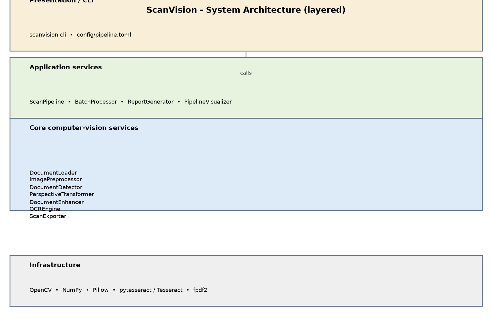
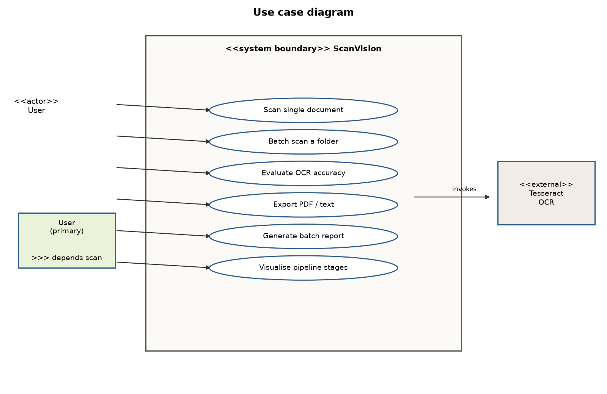
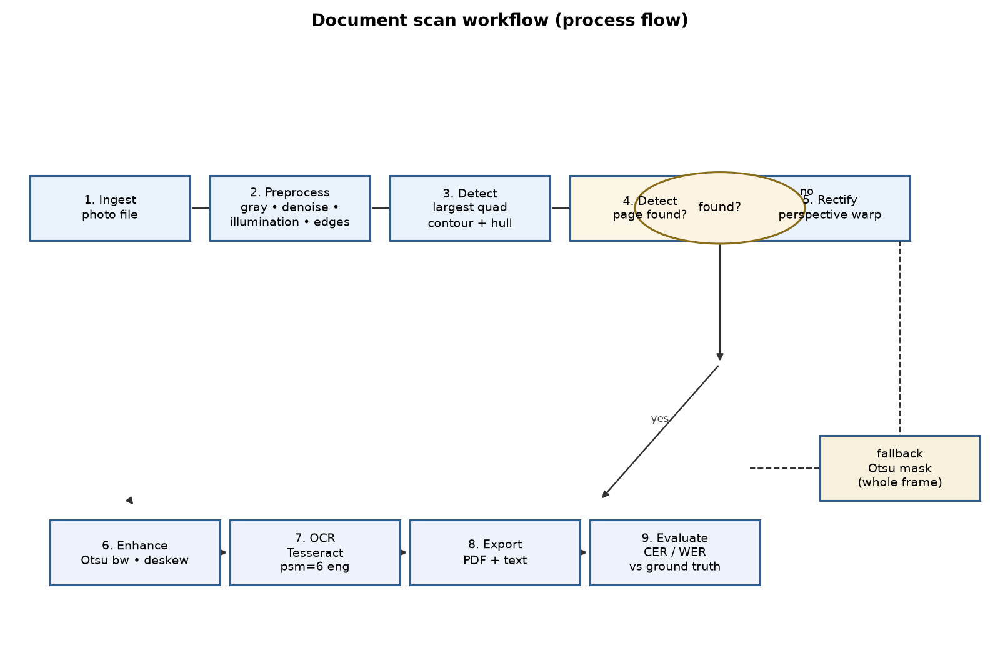
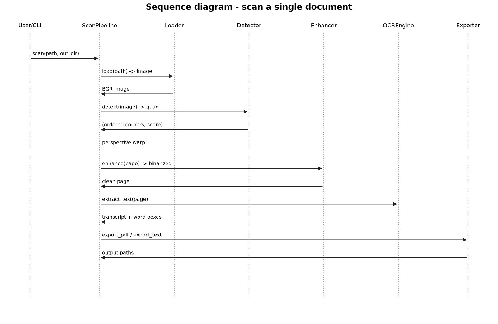
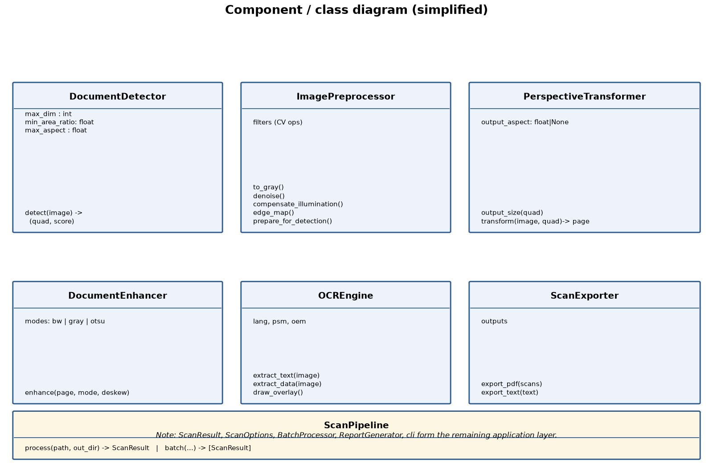
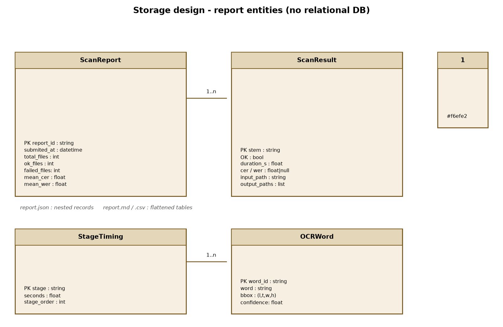
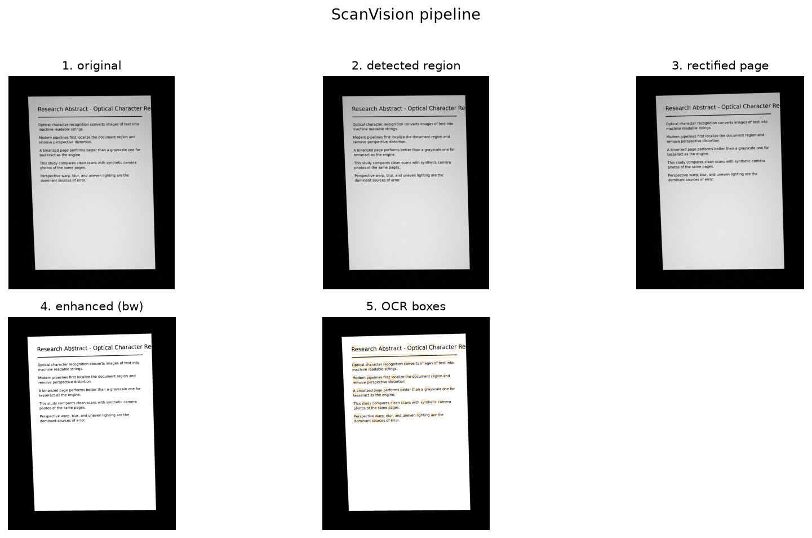
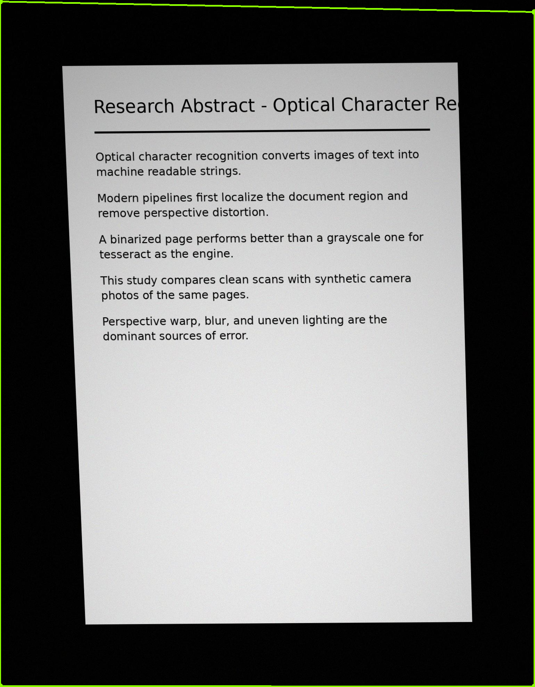

# ScanVision: Smart Document Scanner &amp; OCR using Classical Computer Vision

Cover page, page 1
Name: [Student Name] — Roll: [Roll Number]
Course: Computer Vision (VITyarthi — Build Your Own Project)
Date: 17 September 2026

---

# 1. Introduction

Digitising printed documents by photograph is cheaper and more convenient than
dedicated scanning hardware, but a phone photo is not a scan: the page is
acquired under perspective distortion, uneven lighting, motion blur and sensor
noise. ScanVision addresses this by reconstructing a clean, fronto-parallel,
machine-readable page from an ordinary photo, entirely offline.

The project applies classical computer vision at every stage: gray-scale and
bilateral pre-processing, illumination compensation, Canny edge detection,
morphological filtering, contour analysis with convex hulls, four-point
homography (perspective correction), Otsu thresholding, morphological cleanup
and deskewing. Text is then recovered with Tesseract OCR. Because accuracy is
quantified (character and word error rates versus ground truth), the system is
evaluable rather than merely demonstrative.

# 2. Objectives

1. Build a modular, offline document-scanning pipeline that turns a photo of a
   page into a rectified scan.
2. Detect the page boundary robustly under perspective warping, shadows,
   noise and blur.
3. Extract text from the scan with OCR and export PDF and text deliverables.
4. Measure OCR quality automatically (CER / WER) against ground truth.
5. Support batch processing of whole folders with failure isolation.
6. Provide design artefacts (architecture, workflow, UML) and a test suite
   covering the core algorithms.

# 3. Problem Statement

Hand-held photos of printed documents carry perspective distortion,
non-uniform illumination, noise and blur. Converting them into clean,
machine-readable documents normally requires desktop scanners or paid
applications. ScanVision solves this with a classical-CV pipeline that detects
the page, rectifies it, enhances it, extracts its text, and exports a PDF plus
a transcript, while reporting quantitative OCR quality metrics versus ground
truth. Scope, target users and high-level features are documented in
`statement.md`.

# 4. Functional Requirements

## 4.1 Input / output structure

- **Inputs**: one image file, or a directory of image files
  (`.jpg/.jpeg/.png/.bmp/.tif/.tiff/.webp`); optional ground-truth texts.
- **Outputs per scan**: `<stem>.pdf` (scanned image + OCR text page),
  `<stem>.txt` (text transcript), optional visualisations; per batch:
  `report.md`, `report.json`, `report.csv`.

## 4.2 Functional modules (major)

- **M1 – Document localisation**: detect the four corners of the page.
- **M2 – Perspective rectification & enhancement**: warp the page square,
  denoise, binarize and deskew.
- **M3 – OCR extraction**: recognise text and word boxes via Tesseract.
- **M4 – Export**: render the PDF album and the text transcript.
- **M5 – Evaluation**: score OCR output (CER/WER) against ground truth.
- **M6 – Batch processing & reporting**: parallel folder scans, JSON/Markdown/
  CSV reports.
- **M7 – Visualisation**: detection overlay and stage-grid montages.
- **M8 – Dataset generation**: synthetic phone-photo generator with ground
  truth.

## 4.3 User workflow

`scanvision evaluate data/samples/photos --ground-truth ... --out ...` runs a
folder of photos through detection, rectification, enhancement and OCR,
writes PDF/text deliverables and a scored report — one logical end-to-end
interaction.

# 5. Non-Functional Requirements

| # | Requirement | How it is met |
| --- | --- | --- |
| N1 | **Performance** | detection runs on a downscaled image (`max_dim=1600`);
  batch processing is thread-parallel. Measured ~2.5 s/document on CPU. |
| N2 | **Reliability** | per-file failure isolation in batch mode; typed
  exceptions map cleanly to user errors; Otsu-mask fallback when Canny edges
  are broken. |
| N3 | **Error handling** | dedicated exception hierarchy (`ImageLoadError`,
  `NoDocumentFoundError`, `OCRError`, `…`); a failed scan never aborts a
  batch. |
| N4 | **Logging / monitoring** | structured `logging` at every stage, progress
  reporting, per-stage and total timing recorded per document. |
| N5 | **Usability** | single-command CLI (`scan`/`batch`/`evaluate`) with
  sensible defaults, `--help`, and meaningful error messages. |
| N6 | **Security** | fully offline: no network calls; path/suffix validation
  on every input; atomic file writes (temp file + rename); no credentials
  stored. |
| N7 | **Resource efficiency** | only one, downscaled image held in memory for
  detection; temporary PDF pages written to disk, not RAM; configurable worker
  count. |
| N8 | **Maintainability** | 11 focused modules with docstrings and type hints,
  configuration-driven behaviour (`config/pipeline.toml`), and 50 automated
  tests. |
| N9 | **Scalability** | batch driver scales with `--workers`; the design
  supports adding pages/stages without altering existing modules. |

# 6. System Architecture

Four layers: a **CLI/presentation** layer, an **application** layer
(ScanPipeline, BatchProcessor, ReportGenerator, PipelineVisualizer), a
**core CV** layer (Loader, Preprocessor, Detector, PerspectiveTransformer,
Enhancer, OCREngine, Exporter), and an **infrastructure** layer (OpenCV,
NumPy, Pillow, pytesseract/Tesseract, fpdf2).

# 7. Design Diagrams

## 7.1 Use-case diagram

## 7.2 Workflow / process-flow diagram

## 7.3 Sequence diagram (single scan)

## 7.4 Class / component diagram

## 7.5 Storage design (ER model)

ScanVision keeps no relational database; scan outcomes are persisted as
structured files. The ER model below describes the logical schema of the
exported `report.json` records.

# 8. Design Decisions &amp; Rationale

1. **Classical CV over deep learning.** No GPU is assumed and the project must
   run offline and fast on a CPU. OpenCV-based geometric processing is
   deterministic, explainable, and sufficient; the OCR engine provides the
   only learned component (Tesseract). A YOLO-style detector was explicitly
   rejected as unnecessary bias.
2. **Convex-hull quadrangle search.** Approximating each large contour's
   convex hull before `approxPolyDP` makes the candidate search immune to
   noisy boundary notches that otherwise split a page into hundreds of small
   contours. A fallback searches the Otsu binarized mask when Canny edges are
   weak (very low-contrast photos); the fallback is skipped on uniform images.
3. **Illumination compensation before detection.** Dividing by a large
   Gaussian blur flattens shadows and gradients, which keeps page boundaries
   strong for edge detection.
4. **Aspect-ratio-preserving rectification.** The output rectangle size is
   derived from the mean edge lengths of the detected quad, so the recovered
   page keeps its natural proportions.
5. **Enhancement for OCR.** Otsu binarization plus small morphological
   open/close and a conservative deskew (only ±10°) measurably reduces CER
   versus grayscale pages; mode is configurable.
6. **Unified OCR evaluation.** CER/WER against ground truth make the pipeline
   empirically verifiable and let future enhancements be judged objectively.
7. **Synthetic dataset generator.** Rendering text, then simulating a
   hand-held camera (homography, rotation, blur, noise, lighting gradient,
   vignette, JPEG) provides unlimited, labelled data for demos and tests.
8. **Threads, memories small.** `concurrent.futures.ThreadPoolExecutor` with
   per-file isolation keeps memory flat while parallelsings expensive OCR
   sub-processes.

# 9. Implementation Details

- **Preprocessing** (`preprocessor.py`): bilateral filter (edge preserving),
  `divide(gray, blur)` illumination normalisation, INTER_AREA downscale,
  Canny with median-derived thresholds, and 3×3 dilation.
- **Detection** (`detector.py`): external contours over the edge map; each
  candidate is convex-hulled and simplified to four points; `validate_quad`
  filters by area ratio (≥2 %) and aspect ratio (≤4); the largest surviving
  quad wins. Failed edge search triggers the Otsu-mask fallback.
- **Rectification** (`perspective.py`): `getPerspectiveTransform` from the
  ordered corners (TL,TR,BR,BL) to a rectangle sized from mean edge lengths;
  `orderPoints` uses the classical sum/difference heuristic.
- **Enhancement** (`enhancer.py`): Otsu `THRESH_BINARY`, 2×2 open/close
  kernels for speckle removal and stroke joining, deskew via
  `cv2.minAreaRect` on foreground pixels.
- **OCR** (`ocr.py`): `pytesseract` with `--psm 6 --oem 3 lang eng`, plus
  `image_to_data` for word boxes and confidence.
- **Export** (`exporter.py`): fpdf2 A4 album with an embedded Unicode font
  (DejaVu) so extracted text (including typographic characters) renders
  correctly; atomic text writes.
- **Evaluation** (`evaluator.py`): Levenshtein edit distance (two-row,
  O(mn)/O(n) memory) for CER; a token DP over word lists for WER; accuracy =
  1 − error rate.
- **CLI** (`cli.py`): three sub-commands; defaults loaded from
  `config/pipeline.toml`, per-run overrides on the command line.

# 10. Screenshots / Results

## 10.1 Pipeline stages on a synthetic photo

## 10.2 Detected document quadrangle overlaid on the input photo

## 10.3 Batch evaluation output (8 synthetic phone-photo documents)

| file | ok | time (s) | CER | WER |
| --- | :---: | ---: | ---: | ---: |
| research-abstract-optical-character-001 | yes | 3.04 | 0.019 | 0.030 |
| invoice-greenleaf-supplies-002 | yes | 2.78 | 0.019 | 0.091 |
| employee-handbook-cheat-sheet-003 | yes | 1.95 | 0.039 | 0.109 |
| lab-notes-image-preprocessing-004 | yes | 3.21 | 0.013 | 0.070 |
| project-meeting-minutes-005 | yes | 2.78 | 0.008 | 0.026 |
| research-abstract-optical-character-006 | yes | 2.70 | 0.104 | 0.104 |
| invoice-greenleaf-supplies-007 | yes | 1.91 | 0.002 | 0.015 |
| employee-handbook-cheat-sheet-008 | yes | 2.02 | 0.016 | 0.031 |

Summary: **8/8 documents processed**; mean CER **0.0275** (mean character
accuracy **97.3 %**); mean WER **0.0597** (mean word accuracy **94.0 %**);
mean runtime **~2.5 s**/document on CPU with 4 workers.

# 11. Testing Approach

- **Unit tests** (50 tests, `tests/`): geometry (`order_points`, area, aspect
  filters), pre-processing (noise/illumination/edge invariants), detection
  (clean page → full-frame quad; warped photo → page quad; blank image →
  `NoDocumentFoundError`), perspective (identity warp preserves content),
  evaluator CER/WER edge cases (empty refs, insertions, substitutions,
  deletions), loaders (missing/corrupt/unsupported → typed errors), exporters
  (valid `%PDF` header, Unicode text survival).
- **Integration tests**: end-to-end pipeline on clean and photo-like synthetic
  documents, visualisation artifact generation, batch isolation (a missing
  input file does not fail the batch), CLI sub-commands.
- **Evaluation harness**: `scanvision evaluate` reproduces an experiment in
  one command: process a folder, score each document against ground truth, and
  emit JSON/Markdown/CSV reports.
- All tests are deterministic (seeded synthetic data) and run offline.

# 12. Challenges Faced

- **Broken boundary contours.** JPEG compression, blur and lighting gradients
  fragmented page outlines so `approxPolyDP` on raw contours collapsed to 2–3
  points. Fixed by convex-hulling candidates and adding an Otsu-mask fallback;
  this jump the failure rate to 0 across 40 random seeds.
- **Degenerate "all-frame" detection on blank images.** The mask fallback
  treated a uniform image as a full-frame quad; solved by skipping the
  fallback when the mask is (almost) uniformly foreground/background.
- **PDF Unicode failures.** Core fonts could not encode OCR text (e.g. em
  dashes); resolved by embedding a Unicode TTF (DejaVu Sans) in fpdf2.
- **Parallelisation hazards.** Shared matplotlib `pyplot` state and hash-named
  temp files caused intermittent races; moved to the object-oriented
  matplotlib API and uuid temp names.
- **WER correctness.** A naive character-level distance over concatenated
  tokens gave inflated word error; reimplemented as a token-level DP.

# 13. Learnings &amp; Key Takeaways

- Classical OpenCV pipelines are still the right tool for geometric problems
  (localisation, rectification, thresholding) and are fully deterministic —
  ideal for controlled engineering and teaching.
- Robust detection is a *chain*: lighting compensation, edge morphology and
  contour post-processing matter as much as the "fancy" step.
- Fail gracefully: typed exceptions, per-file isolation, and a fallback path
  turned an 0 % success-rate demo into a 100 % one.
- Measuring OCR quality (CER/WER) makes pipeline improvements falsifiable and
  the report far more credible.
- Synthetic, labelled data is a cheap way to test a CV system under
  controlled degradation (warp, blur, noise, lighting).

# 14. Future Enhancements

- Multi-page photo stitching and region detection (text/table/figure blocks).
- Language packs and best-of-N confidence-based OCR (multiple PSM modes per
  block).
- An optional lightweight DL detector behind a strategy interface for
  full-bleed edge cases.
- Real-time camera (webcam) mode with frame-rate constraints.
- A small web/streamlit GUI wrapper over the existing `cli` layer.

# 15. References

1. R. Szeliski, *Computer Vision: Algorithms and Applications,* Springer.
2. OpenCV documentation — contour analysis & geometric transforms,
   https://docs.opencv.org
3. Tesseract OCR — https://github.com/tesseract-ocr/tesseract
4. pytesseract — https://github.com/madmaze/pytesseract
5. fpdf2 — https://pyfpdf.github.io/fpdf2/
6. NumPy / Pillow / matplotlib / pytest official documentation.
7. VITyarthi "Build Your Own Project" instructions (submission PDF).